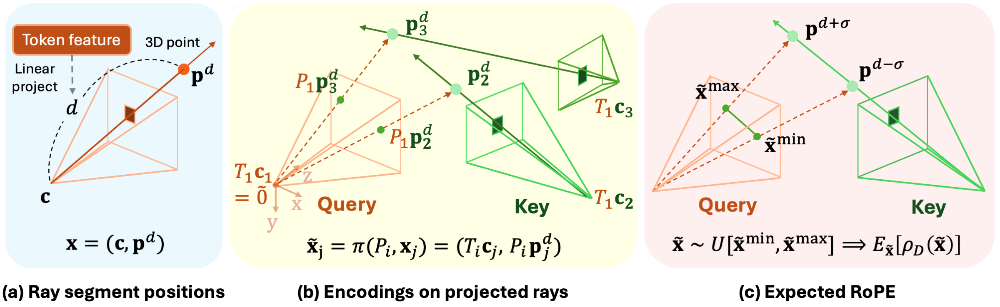

<p align="center">
  
  
</p>

<h3 align="center">
  <a href="https://rayrope.github.io/">Project Page</a> | <a href="https://arxiv.org/abs/2601.15275v1">arXiv</a>
</h3>

This is the official code for the paper: RayRoPE: Projective Ray Positional Encoding for Multi-view Attention.

<p align="center">
  
</p>

## Updates
- [02.11.2026] Bug fix for cross-attention. Added demo notebook.
- [02.04.2026] Released model weights for LVSM with RayRoPE
- [02.04.2026] Updated instructions on using RayRoPE and restructured the code
- [01.26.2026] Updated code for preparing the datasets (CO3D, RE10K, and Objaverse)
- [01.26.2026] Updated instructions in this README

#### To-dos
- Release code for stereo depth experiments

# Using RayRoPE

Using RayRoPE is easy: all you need are two files: 
- `pos_enc.rayrope.py`
- `pos_enc.utils.rayrope_mha.py`

We provide a jupyter notebook `scripts/example_usage.ipynb` demonstrating how to incorporate RayRoPE into multi-view attention modules. Here is a step-by-step guide: 

**1.** Initialize the RayRoPE encoding and the multi-head attention module we provide: 

```python
from pos_enc.rayrope import RayRoPE_DotProductAttention
from pos_enc.utils.rayrope_mha import MultiheadAttention

rayrope_attn = RayRoPE_DotProductAttention(...)
mha_layer = MultiheadAttention(..., sdpa_fn=self.rayrope_attn.forward) # Replace regular MHA with this
```

**2.** At the beginning of the forward pass, initialize the RayRoPE encodings with input camera poses:

```python
rayrope_attn._precompute_and_cache_apply_fns(
    w2cs,  # Input camera extrinsics. shape [B, nC, 4, 4]
    Ks,    # Input camera intrinsics. shape [B, nC, 3, 3]
)
```

**3.** You don't need any specific modification to call the attention. Calling the `mha_layer` will automatically compute attention with RayRoPE applied. 

**4.** For cross-attention, use the file `pos_enc.rayrope_cross_attention.py` instead. Additionally, set `cross_attn=True` when initializing the MHA modules.

```python
from pos_enc.rayrope_cross_attention import RayRoPE_DotProductAttention_Cross
from pos_enc.utils.rayrope_mha import MultiheadAttention

rayrope_cross_attn = RayRoPE_DotProductAttention_Cross(...)
mha_layer = MultiheadAttention(..., sdpa_fn=self.rayrope_cross_attn.forward, 
                                cross_attn=True) # Replace regular MHA with this

rayrope_cross_attn._precompute_and_cache_apply_fns(
    w2cs,     # extrinsics of query views
    Ks,       # intrinsics of query views
    w2cs_kv,  # extrinsics of key/value views
    Ks_kv,    # intrinsics of key/value views
)
```


# NVS Experiment 
## Environment Setup

```
conda create -n rayrope python=3.11
pip install -r requirements.txt 
```

## Dataset Setup

### CO3D
First download the CO3Dv2 from [here](https://github.com/facebookresearch/co3d/tree/main).

Then, preprocess the annotations: (code adapted from [RayDiffusion](https://github.com/jasonyzhang/RayDiffusion/blob/main/docs/train.md))
```
python ./scripts/co3d_preprocess --category all --precompute_bbox --co3d_v2_dir /path/to/co3d_v2
python ./scripts/co3d_preprocess --category all --co3d_v2_dir /path/to/co3d_v2
```

### RealEstate10K
There are two options to download RealEstate10K

#### Option 1
This is the option we use. Download the preprocessed RE10K dataset released by [pixelSplat](https://github.com/dcharatan/pixelsplat) with the following command:

```
wget -c "http://schadenfreude.csail.mit.edu:8000/re10k.zip" -P {YOUR_RE10K_DIR}/re10k_raw
```

Process the downloaded ray data using `scripts/lvsm_process_data_re10k.py`. This file is adapted from the official LVSM repo.
```
python scripts/re10k_lvsm_process_data.py --base_path {YOUR_RE10K_DIR}/re10k_raw --output_dir {YOUR_RE10K_DIR}/re10k --mode ['train' or 'test']
```

The resulting data is organized in the format used by the official LVSM repo. However, our repo expects a slightly different format. We convert them using the following command:

```
python scripts/re10k_convert_data_format.py --source_dir {YOUR_RE10K_DIR}/re10k_raw --output_dir {YOUR_RE10K_DIR}/re10k_processed
```

#### Option 2
Download re10k directly following the instructions in the PRoPE repo. The resulting format should be compatible with our code. Note that some of the videos are no longer available on the web.

### Objaverse
We use an 80K high-quality subset of Objaverse provided by [LGM](https://github.com/3DTopia/LGM?tab=readme-ov-file). The object IDs are stored in `assets/kiuisobj_v1_merged_80K.csv`.

First, download the Objaverse 3D assets, following the instructions in the official [documentation](https://objaverse.allenai.org/docs/intro). 

To better benchmark the ability of different positional encodings to capture large, diverse camera variations, we render the dataset with varying intrinsics, using `scripts/objv_render_vary_intrinsics.py`. For batch-rendering the dataset on a slurm cluster, we provide a submitit script `scripts/objv_submitit_batch_render.py`. To use, first set the path `OBJV_GLB_ROOT` and `OBJV_DIR` in the script, and run:
```
python scripts/objv_submitit_batch_render.py
```

## Training
Both training and testing can be launched by `scripts/nvs.sh`. Before using, first set the dataset paths at the beginning of the script. 
We support training LVSM with different multi-view positional encodings (e.g., Plucker raymap, GTA, PRoPE, RayRoPE). For example, training with `RayRoPE` on CO3D is via:

```
scripts/nvs.sh --dataset co3d
```

See `bash ./scripts/nvs.sh -h` for helper information.

## Pretrained Checkpoints
The pretrained checkpoints of LVSM with RayRoPE are available for download [here](https://huggingface.co/Lucas7W7/RayRoPE/tree/main). For each dataset, we release two checkpoints: one smaller version used in the main experiments and one larger version described in Appendix E of the paper.

| Checkpoint path | #Layers | Model size |
| --- | --- | --- |
| co3d/lvsm-rayrope-co3d.pt | 6 | 47M |
| re10k/lvsm-rayrope-re10k.pt | 6 | 47M |
| objv/lvsm-rayrope-objv.pt | 6 | 47M |
| co3d_L12/lvsm-rayrope-co3d-L12.pt | 12 | 150M |
| re10k_L12/lvsm-rayrope-re10k-L12.pt | 12 | 150M |
| objv_L12/lvsm-rayrope-objv-L12.pt | 12 | 150M |

For example, to run the downloaded checkpoints on the corresponding test dataset, run:
```
scripts/nvs.sh --dataset co3d --test --test-ckpt /directory/to/downloaded/ckpts/co3d

scripts/nvs.sh --dataset re10k --num_layers 12 --dim_feedforward 3072 \
--test --test-ckpt /directory/to/downloaded/ckpts/re10k_L12
```

# Acknowledgements
This work was supported by Apple. We thank Zihan Wang and Qitao Zhao for insightful discussions throughout the project. Additionally, our implementation is built upon the open-source frameworks [PRoPE](https://github.com/liruilong940607/prope) and [Unimatch](https://github.com/autonomousvision/unimatch); we are grateful to the authors for making their code available.

# Citation
If you find our work useful, please consider citing us:
```
@article{wu2026rayrope,
  title={RayRoPE: Projective Ray Positional Encoding for Multi-view Attention},
  author={Wu, Yu and Jeon, Minsik and Chang, Jen-Hao Rick and Tuzel, Oncel and Tulsiani, Shubham},
  journal={arXiv preprint arXiv:2601.15275},
  year={2026}
}
```
